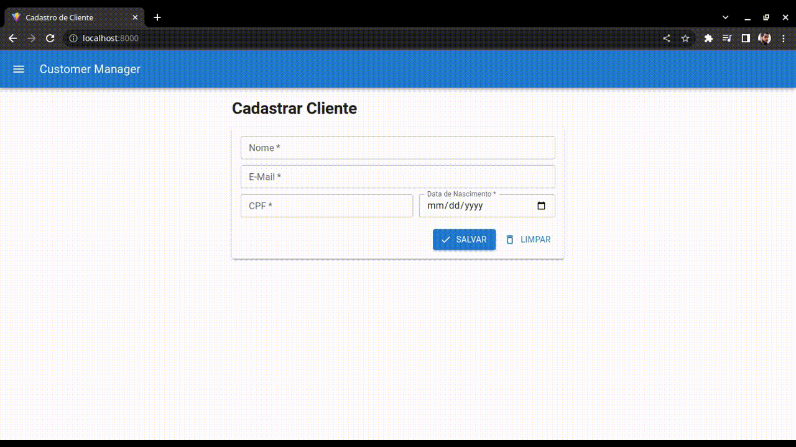

## 💭 Oque é esse projeto?
Bem-vindo ao repositório do **Customer Manager**! Esta aplicação fornece aos usuários uma experiência perfeita para **registrar** e **pesquisar** clientes **de um banco de dados**. Ele foi construído usando tecnologias populares como **React**, **React Router**, **Material UI**.

## 🔥 Como rodar esse projeto?
- Primeiro baixe o repositório (seja pelas por `git clone` ou através de um arquivo .zip pelo Github).
- Com o projeto já **baixado** e descompactado entre na pasta e **rode o comando** `npm install` para baixar e instalar todas as dependencias!!
- Agora dê o comando `npm run dev` ou `yarn dev` para iniciar o Front-End do projeto.
- O projeto estará disponível para acesso apartir de um link mais ou menos assim `http://127.0.0.1:5173/`.
- Pronto agora e só conectar com a API [link](https://github.com/drewdomi/CustomerManager-server)

## 💡 Características principais:

- **Cadastro de Clientes**: Os usuários podem registrar facilmente novos clientes inserindo detalhes relevantes, como Nome, E-Mail e CPF.
- **Pesquisa de clientes**: Permite que os usuários pesquisem clientes no banco de dados com parâmetros, incluindo Nome e ID, facilitando a localização rápida de indivíduos específicos.
- **Edição do cliente**: os usuários têm a capacidade de atualizar as informações do cliente, como Nome e E-Mail, garantindo dados precisos e atualizados.
- **Exclusão de Clientes**: Fornece funcionalidade para excluir clientes do banco de dados quando necessário, removendo suas informações de futuros resultados de pesquisa.
- **Verificação do número do documento**: para aumentar a precisão dos dados, a aplicação faz a validação do CPF, garantindo que apenas documentos válidos sejam inseridos no sistema.
- **Design Responsivo**: O aplicativo foi desenvolvido usando React e Material UI, fornecendo uma interface de usuário intuitiva e visualmente atraente que se adapta perfeitamente a diferentes tamanhos de tela e dispositivos.

## 🖥️ Tecnologias Utilizadas:

- **React**: uma biblioteca JavaScript popular usada para criar interfaces de usuário, permitindo renderização eficiente e atualizações contínuas.

- **React Router**: Uma poderosa biblioteca de roteamento para React que facilita a navegação e o gerenciamento de URL dentro do aplicativo.

- **Material UI**: Uma biblioteca de componentes de UI que oferece componentes pré-estilizados e prontos para uso e customizações, garantindo um design moderno e visualmente agradável.

- **TypeScript**: Um supersest JavaScript que adiciona recursos de tipagem estática e outros recursos avançados para melhorar a produtividade e a qualidade do código. Ele nos ajuda a evitar erros comuns e oferece um ambiente de desenvolvimento mais robusto.

## ✅ Todos

- [x] Adicionar Rotas
- [x] Layout página de cadastro do cliente
- [x] Layout página de pesquisa do cliente
- [x] Salvar cadastro de cliente
- [x] Pesquisar cadastro de cliente
- [x] Editar cadastro de cliente

Acreditamos que este aplicativo para gerenciamento de clientes simplificará e agilizará muito as operações relacionadas a cadastros de novos clientes no banco de dados e a consulta do mesmo. Sinta-se à vontade para explorar o repositório, contribuir e fornecer feedback para nos ajudar a melhorar ainda mais o aplicativo.
